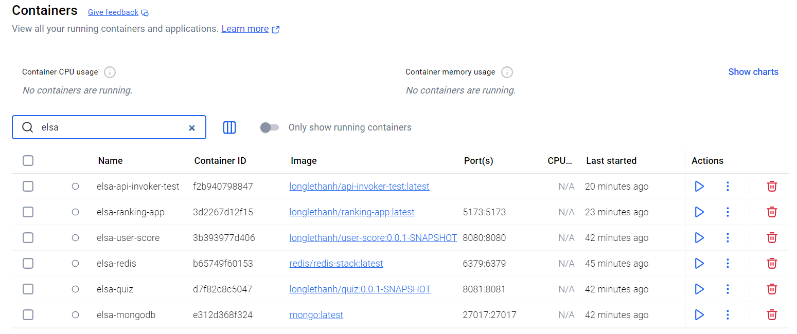

# elsa-ranking-app

# Tech stack & requirements
- NodeJS
- TypeScript
- ReactJS

- Node must be installed on local dev-env.
- The quiz service and user score service must be started.

# How-to

Start server on local:
..\ranking-app> npm install
..\ranking-app> npm run dev

Access user score ranking app on local:
http://localhost:5173/

# Docker
ranking-app> docker build -t longlethanh/ranking-app .
ranking-app> docker push longlethanh/ranking-app
ranking-app> docker run -d -p 5173:5173 --name elsa-ranking-app --network elsa-vpn longlethanh/ranking-app:latest

